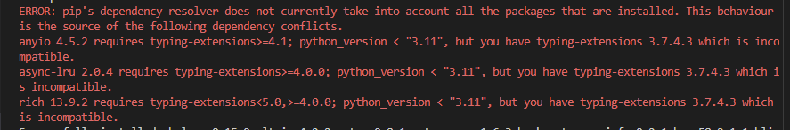

# Heritage Housing.

## Overview

Heritage housing is a data analysis project aimed at supporting a client's desire to maximise the sale price of houses they have inherited in Ames, Iowa. The client has provided a set of data detailing the sale price of houses in that area along with particular features of those houses. They have asked us to use this to determine the best possible sale price for her houses, and provide an understanding of how the features of a house affect sale price. This is fully explored in the Business Requirements section below. Results of this analysis are to be presented in a streamlit dashboard hosted on [Heroku](https://heritage-house-9fb9b02e459c.herokuapp.com/).

## Dataset Content

* The dataset is sourced from [Kaggle](https://www.kaggle.com/codeinstitute/housing-prices-data).

* The dataset has almost 1.5 thousand rows and represents housing records from Ames, Iowa, indicating house profile (Floor Area, Basement, Garage, Kitchen, Lot, Porch, Wood Deck, Year Built) and its respective sale price for houses built between 1872 and 2010.

|Variable|Meaning|Units|
|:----|:----|:----|
|1stFlrSF|First Floor square feet|334 - 4692|
|2ndFlrSF|Second-floor square feet|0 - 2065|
|BedroomAbvGr|Bedrooms above grade (does NOT include basement bedrooms)|0 - 8|
|BsmtExposure|Refers to walkout or garden level walls|Gd: Good Exposure; Av: Average Exposure; Mn: Minimum Exposure; No: No Exposure; None: No Basement|
|BsmtFinType1|Rating of basement finished area|GLQ: Good Living Quarters; ALQ: Average Living Quarters; BLQ: Below Average Living Quarters; Rec: Average Rec Room; LwQ: Low Quality; Unf: Unfinshed; None: No Basement|
|BsmtFinSF1|Type 1 finished square feet|0 - 5644|
|BsmtUnfSF|Unfinished square feet of basement area|0 - 2336|
|TotalBsmtSF|Total square feet of basement area|0 - 6110|
|GarageArea|Size of garage in square feet|0 - 1418|
|GarageFinish|Interior finish of the garage|Fin: Finished; RFn: Rough Finished; Unf: Unfinished; None: No Garage|
|GarageYrBlt|Year garage was built|1900 - 2010|
|GrLivArea|Above grade (ground) living area square feet|334 - 5642|
|KitchenQual|Kitchen quality|Ex: Excellent; Gd: Good; TA: Typical/Average; Fa: Fair; Po: Poor|
|LotArea| Lot size in square feet|1300 - 215245|
|LotFrontage| Linear feet of street connected to property|21 - 313|
|MasVnrArea|Masonry veneer area in square feet|0 - 1600|
|EnclosedPorch|Enclosed porch area in square feet|0 - 286|
|OpenPorchSF|Open porch area in square feet|0 - 547|
|OverallCond|Rates the overall condition of the house|10: Very Excellent; 9: Excellent; 8: Very Good; 7: Good; 6: Above Average; 5: Average; 4: Below Average; 3: Fair; 2: Poor; 1: Very Poor|
|OverallQual|Rates the overall material and finish of the house|10: Very Excellent; 9: Excellent; 8: Very Good; 7: Good; 6: Above Average; 5: Average; 4: Below Average; 3: Fair; 2: Poor; 1: Very Poor|
|WoodDeckSF|Wood deck area in square feet|0 - 736|
|YearBuilt|Original construction date|1872 - 2010|
|YearRemodAdd|Remodel date (same as construction date if no remodelling or additions)|1950 - 2010|
|SalePrice|Sale Price|34900 - 755000|

#### Initial observations
1. We don’t know the extent to which the data set captures all of the house sales in the area, or if the distribution reflects the city.
2. There is significant missing data. We will need a strategy to deal with this.
3. We don’t know the time of sale. The housing market can vary over time based on factors such s a change in interest rates.
4. We don’t know the location within the city. The housing market can vary tremendously in an area depending on factors such as crime rate, distance to amenities etc.

## Business Requirements

The business requirements are defined in [Handbook: Heritage Housing Issues](https://learn.codeinstitute.net/courses/course-v1:CodeInstitute+PA_PAGPPF+2/courseware/bde016cdbd184cdeafd341a73807e138/bd2104eb84de4e48a9df6f685773cbf2/) from The Code Institute.

As a good friend, you are requested by your friend, who has received an inheritance from a deceased great-grandfather located in Ames, Iowa, to  help in maximising the sales price for the inherited properties.

Although your friend has an excellent understanding of property prices in her own state and residential area, she fears that basing her estimates for property worth on her current knowledge might lead to inaccurate appraisals. What makes a house desirable and valuable where she comes from might not be the same in Ames, Iowa. She found a public dataset with house prices for Ames, Iowa, and will provide you with that.

1 - The client is interested in discovering how the house attributes correlate with the sale price. Therefore, the client expects data visualisations of the correlated variables against the sale price to show that.
2 - The client is interested in predicting the house sale price from her four inherited houses and any other house in Ames, Iowa.

#### Is there any business requirement that can be answered with conventional data analysis?
1 -  Yes, we can use conventional data analysis to investigate how house attributes are correlated with the sale prices.

#### Does the client need a dashboard or an API endpoint?
1 - The client needs a dashboard

#### What does the client consider as a successful project outcome?
1 - A study showing the most relevant variables correlated to sale price.
2 - Also, a capability to predict the sale price for the 4 inherited houses, as well as any other house in Ames, Iowa.

#### Can you break down the project into Epics and User Stories?
1 - Information gathering and data collection.
2 - Data visualisation, cleaning, and preparation.
3 - Model training, optimization and validation.
4 - Dashboard planning, designing, and development.
5 - Dashboard deployment and release.

These epics were used to develop user stories added to a [kanban board](https://github.com/users/ewradcliffe/projects/6) in the project repository.

#### Ethical or Privacy concerns?
1 - No. The client found a public dataset.

#### Does the data suggest a particular model?
1 - The data suggests a regressor where the target is the sale price.

#### What are the model's inputs and intended outputs?
1 - The inputs are house attribute information and the output is the predicted sale price.

#### What are the criteria for the performance goal of the predictions?
1 - We agreed with the client an R2 score of at least 0.75 on the train set as well as on the test set.

#### How will the client benefit?
1 - The client will maximise the sales price for the inherited properties.

## Hypothesis and how to validate?

1 -  We believe there is a positive correlation between the size of a house and the price of a house. We can perform a correlation study to demonstrate this relationship. We expect the relationship to be monotonic. House price will increase as the size increases.

2 - We believe there is a positive correlation between the condition of a house and the price of a house. We can perform a correlation study to demonstrate this relationship. We expect the relationship to be monotonic. House price will increase as quality improves.

3 - We believe that the age of the house and how recently it was refurbished is not correlated with the price of the house. We can perform a correlation study to demonstrate this.

These hypotheses are derived from a cursory examination of the data and conventional wisdom about factors determining house prices. At this stage they may be seen as closer to heuristics. We will revisit them after each stage to see if we can refine them.

## The rationale to map the business requirements to the Data Visualisations and ML tasks
- **Business Requirement 1:** The client is interested in discovering how house attributes correlate with sale prices. Therefore, the client expects data visualisations of the correlated variables against the sale price.

1 -  We will inspect the data related to house prices
2 - We will perform Pearson and Spearman correlation studies to investigate how the variables are related to Sale Price.
3 - We can extract the most important variables.
5 - We will plot the main variables against Sale Price to assist the client in visualising the relationship between them.
6 - We will display this on the dashboard.

- **Business Requirement 2:** The client is interested in predicting the house sale prices from her 4 inherited houses, and any other house in Ames, Iowa.
1 - We want to be able to predict the best sale price of the clients houses. We want to use an ML model based on regression analysis.
2 - We can train, validate and test the model using the data provided. 
3 - We can use this model to provide the client with estimations as to the best sale price for her houses, and display it on the dashboard.
4 - We can add input widgets for the most important variables to the dashboard, so the client can see the potential Sale Price of any other house in Ames, Iowa.

## ML Business Case
### Predict house prices
#### Regression Model
1 - We want an ML model to predict the highest sale price based on the data collected. As the target variable is price, a regression model is most appropriate. We want to be able to output a single figure - price. 

2 - The ideal outcome is to be able to provide our client with a tool for accurately predicting house prices and an understanding of what the most important variables for determining house prices are.

3 - We agreed with the client an R2 score of at least 0.75 on the train set as well as on the test set.

4 - We can also investigate different models for a better R2 score,

## Dashboard Design

### Page 1: Quick project summary
1 - Project Terms & Jargon
	- SalePrice - The price at which a house sale is agreed
2 - Describe Project Dataset
3 - State Business Requirements

### Page 2: Findings 
1 - Detail which features are most important in determining house prices.
2 - Demonstrate the proof.

### Page 3: Display 4 houses' attributes and their respective predicted sale price. 
1 - Display a message informing the summed predicted price for all 4 inherited houses.
2 - Add interactive input widgets that allow a user to provide real-time house data to predict the sale price.
3 -  When creating the input widgets for house price prediction, it is critical that the input features are input into the model in the same order that was used when the model was trained. Refer back to the lesson for the code.

### Page 4: Hypothesis
1 - List Hypothosis
2 - Explain how these were validated

### Page 5: Peformance (For technical users)
1 - Display model Performance
2 - Display ML pipeline.

## Testing
The following tests were conducted on the streamlit dashboard
| Page | Test | Pass |
| ----: |  ----: | ----: |
| Project Summary | Page renders | ✓ |
| Project Summary | Link to kaggle dataset works | ✓ |
| Project Summary | Link to READMe works | ✓ |
| Project Summary | Project Terms & Jargon displayed | ✓ |
| Project Findings | Page renders | ✓ |
| Project Findings | Most important features dataframe renders | ✓ |
| Project Findings | Combined Pearson and Spearman correlations dataframe renders when box ticked | ✓ |
| Project Findings | Strongly correlated features chart renders | ✓ |
| Predict Sale Price | Page renders | ✓ |
| Predict Sale Price | Inherited house prices predictions dataframe renders | ✓ |
| Predict Sale Price | House price prediction renders when get my house price button clicked | ✓ |
| Predict Sale Price | Users can select all four possible KitchenQual radio buttons | ✓ |
| Predict Sale Price | Users can select all 1 -10 possible OverallQual radio buttons | ✓ |
| Predict Sale Price | Users can select 0 - 3000 on GarageArea slider | ✓ |
| Predict Sale Price | Users can select 0 - 3000 on GarageArea slider | ✓ |
| Predict Sale Price | Users can select 0 - 10,000 on GrLivArea slider | ✓ |
| Predict Sale Price | Users can select 0 - 10,000 on TotalBsmtSF slider | ✓ |
| Project Hypothesis | Page renders | ✓ |
| Project Hypothesis | Hypothesis 1 results shown | ✓ |
| Project Hypothesis | Hypothesis 2 results shown | ✓ |
| Project Hypothesis | Hypothesis 3 results shown | ✓ |
| Project Hypothesis | Graphs renders when boxes ticked | ✓ |
| Technical Information | Page renders | ✓ |
| Technical Information | Up to date R2 scores for train, validate and test set displayed | ✓ |
| Technical Information | Pipeline steps displayed | ✓ |
| Technical Information | Model Information displayed | ✓ |

Note that in particular I tested that the model predictions were in line with the hypothesis. Each feature was tested by increasing and decreasing the rating while other features were kept the same. 

| Feature | Test | Pass |
| ----: |  ----: | ----: |
| KitchenQual | Price prediction increases when rating increases | ✓ |
| KitchenQual | Price prediction decreases when rating decreases | ✓ |
| OverallQual | Price prediction increases when rating increases | No |
| OverallQual | Price prediction decreases when rating decreases | ✓ |
| GarageArea | Price prediction increases when GarageArea size increases | ✓ |
| GarageArea | Price prediction decreases when GarageArea size decreases | ✓ |
| GrLivArea | Price prediction increases when GrLivArea size increases | ✓ |
| GrLivArea | Price prediction decreases when GrLivArea size decreases | ✓ |
| TotalBsmtSF | Price prediction increases when TotalBsmtSF size increases | ✓ |
| TotalBsmtSF | Price prediction decreases when TotalBsmtSF size decreases | ✓ |

* Note that when OverallQual is increased from a rating of 1-2 the price remains static, rather than increasing. This is still in line with the hypothesis. On all other occassions an increase in rating leads to an increase in price. 

## Validation
app.py and all files in the app_pages folder are PEP8 compliant. The pass through the Code Institute [PEP8 linter](https://pep8ci.herokuapp.com/) with no errors.

## Unfixed Bugs
There is a dependency issue in the packages in the Code Institute template. The below error message appears when they are installed.  

To resolve this enter `pip install "anyio<4.0" "async-lru<2.0" "rich<10.0"` followed by `pip install twine==3.7.1` to resolve the conflict.

## Deployment
The latest version of the App is deployed on [Heroku](https://heritage-house-9fb9b02e459c.herokuapp.com/)

* The project was deployed to Heroku using the following steps.

1. Log in to Heroku and create an App
2. At the Deploy tab, select GitHub as the deployment method.
3. Select your repository name and click Search. Once it is found, click Connect.
4. Select the branch you want to deploy, then click Deploy Branch.
5. The deployment process should happen smoothly if all deployment files are fully functional. Click the button Open App on the top of the page to access your App.
6. If the slug size is too large then add large files not required for the app to the .slugignore file.

* You may need to set the runtime.txt Python version to a [Heroku-20](https://devcenter.heroku.com/articles/python-support#supported-runtimes) stack currently supported version.

* To log into the Heroku toolbelt CLI:

1. Log in to your Heroku account and go to *Account Settings* in the menu under your avatar.
2. Scroll down to the *API Key* and click *Reveal*
3. Copy the key
4. In your Cloud IDE, from the terminal, run `heroku_config`
5. Paste in your API key when asked

You can now use the `heroku` CLI program - try running `heroku apps` to confirm it works. This API key is unique and private to you so do not share it. If you accidentally make it public then you can create a new one with *Regenerate API Key*.

### To fork

1. Log into Github, or create an account. 

2. Click 'Create fork' and select '+ Create new fork'

3. Once the repo has been created, Click the 'Code' button and copy the URL.

4. Log into the cloud-based IDE with your GitHub account.

5. On your Dashboard, click on the Create button

6. Paste in the URL you copied from GitHub earlier

7. Click Create

8. Wait for the workspace to open. This can take a few minutes.

9. Open a new terminal and `pip3 install -r requirements.txt`

10. You may see the error below:

11. If so enter `pip install "anyio<4.0" "async-lru<2.0" "rich<10.0"` followed by `pip install twine==3.7.1` to resolve the conflict.

12. Open the jupyter_notebooks directory and click on the notebook you want to open.

13. Click the kernel button and choose Python Environments.

Note that the kernel says Python 3.8.18 as it inherits from the workspace so it will be Python-3.8.18 as installed by our template. To confirm this you can use `! python --version` in a notebook code cell.

## Main Data Analysis and Machine Learning Libraries

The below libraries were used in the project. The versions used are in brackets after the name.

* numpy (1.19.2). A library for managing numbers and arrays in Python. Most of the packages below need numpy as a prerequasit.

* pandas (1.1.2). To Convert CSV files and numpy arrays into data frames. 

* matplotlib (3.3.1). To provide data visualisations, including a visualisation of the features which strongly correlate with SalePrice in the streamlit dashboard. Matplotlib offers more customisation than seaborn.

* seaborn (0.11.0). To provide data visualisations, including visualisations showing hypotheses in the streamlit dashboard. Seaborn offers analysts powerful and effective visualisations where no customisation is needed

* streamlit (0.85.0). Was used to create the dashboard.

* feature-engine (1.0.2). OrdinalEncoder, vt.PowerTransformer and Winsorizer were used in the pipeline to encode data prior to training the machine learning model.

* scikit-learn (0.24.2 ). Pipeline and StandardScaler were used in the pipeline to encode data prior to training the machine learning model. The scikit-learn Ordinal Encoder was used to encode categorical data prior to the correlation study.

* tensorflow-cpu (2.6.0) and keras (2.6.0) were used to create a neural network model.

* plotly (4.12.0), protobuf (3.20) & altair (<5>). Are installed as part of the Code Institute template but not used.

## Credits

### Content

* The business case was taken from [Handbook: Heritage Housing Issues](https://learn.codeinstitute.net/courses/course-v1:CodeInstitute+PA_PAGPPF+2/courseware/bde016cdbd184cdeafd341a73807e138/bd2104eb84de4e48a9df6f685773cbf2/) from The Code Institute

* This ReadMe was based on [milestone-project-heritage-housing-issues](https://github.com/Code-Institute-Solutions/milestone-project-heritage-housing-issues) from The Code Institute

* Formula for calculating IQR from [How To Find Outliers in Data Using Python (and How To Handle Them)](https://careerfoundry.com/en/blog/data-analytics/how-to-find-outliers/#finding-outliers) by Eric Kleppen in Career Foundry.

* [How to Handle Missing Values of Categorical Variables?](https://www.analyticsvidhya.com/blog/2021/04/how-to-handle-missing-values-of-categorical-variables/) from analyticsvidhya.

* Ordinal Encoding discussion on [Stack Exchange](https://datascience.stackexchange.com/questions/72343/encoding-with-ordinalencoder-how-to-give-levels-as-user-input)

* Pearson correlation vs. Spearman correlation methods from [https://uk.surveymonkey.com/](https://uk.surveymonkey.com/market-research/resources/pearson-correlation-vs-spearman-correlation/)

### Media
* Icon from https://smiley.cool/twitter-emoji.php

## Acknowledgements (optional)

[Hypothesis testing for data scientists](https://towardsdatascience.com/hypothesis-testing-for-data-scientists-everything-you-need-to-know-8c36ddde4cd2)  by Alicia Horsch
What is CRISP DM? By Nick Hotz for Data Science Process Alliance.

I would like to thank my mentor, Mo Shami, encouragement and comments.
